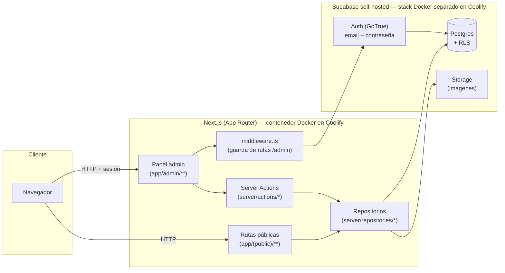

# Arquitectura de Software — Aitor OS

## 1. Visión general

Aitor OS es una web personal (marca personal + base de conocimiento + centro de actividad) gestionada desde un panel de administración propio. No es un sitio estático: el contenido de Proyectos, Digital Garden, Lab y Recursos se crea, edita, publica y destaca desde un backend a medida.



## 2. Decisiones de arquitectura

| Decisión | Elección | Motivo |
|---|---|---|
| Arquitectura de la app | Next.js full-stack monolítico (App Router) | Un único proyecto y un único contenedor Docker para frontend público, panel admin y backend. Menos piezas que operar en un despliegue self-hosted gestionado por una sola persona. |
| Datos, Auth y Storage | Supabase self-hosted | Postgres + Auth (GoTrue) + Storage bajo el propio control del usuario, sin depender de servicios cloud de terceros. |
| Despliegue | Coolify self-hosted, vía Docker | La app se empaqueta como imagen Docker estándar (`output: 'standalone'` de Next.js), sin depender de features exclusivas de una plataforma como Vercel. |
| Autenticación | Email + contraseña (Supabase Auth), registro público desactivado | Panel de un único administrador; no hace falta passwordless ni gestión de invitaciones. |
| Modelo de permisos | Single-admin, reforzado con tabla `app_admins` + RLS | La verificación real de "quién puede escribir" vive en la base de datos (Row Level Security), no solo en el código de la app — así una fuga en el frontend no compromete los datos. |
| Control editorial | Flags `is_published` / `is_featured` por entidad | Es el mecanismo mínimo que resuelve el requisito de "ocultar/mostrar y destacar": no hace falta un sistema de configuración aparte, el propio dato decide qué se muestra en Inicio/Dashboard. |
| Taxonomías (categorías, estados) | `ENUM` de Postgres | Son vocabularios fijos definidos por el concepto del sitio (Seed/Growing/Evergreen, Idea/En desarrollo/Beta/...), no listas que el usuario necesite ampliar dinámicamente. |

## 3. Modelo de datos

### 3.1 Colecciones editoriales (con `is_published` / `is_featured`)

- **`projects`** (+ `project_screenshots` para la galería): nombre, descripción, problema/solución, tecnologías, arquitectura, estado (`idea` → `paused`), progreso, enlaces, aprendizajes, próximos pasos.
- **`garden_notes`** (+ `garden_note_relations` auto-referenciada): título, categoría (Sistemas/Desarrollo/IA/Ideas), estado (Seed/Growing/Evergreen), contenido, ejemplos, comandos, referencias.
- **`lab_experiments`**: numeración autoincremental (`LAB #014`), stack, estado, enlaces.
- **`resources`**: tipo (herramienta/librería/curso/libro/repo/doc/prompt/snippet), enlace.

Estas cuatro comparten el mismo patrón de columnas de control: `is_published boolean`, `is_featured boolean`, `sort_order`, `created_at`/`updated_at`. Inicio y Dashboard consultan siempre `WHERE is_published AND is_featured` — destacar algo en el admin **es** el mecanismo de "qué aparece en portada".

### 3.2 Colecciones de edición directa (sin flujo de publicación)

- **`now_items`**: contenido de `/now` (trabajando en / aprendiendo / explorando). Estado efímero, se sobrescribe, no se "publica".
- **`stack_items`**: tecnologías por categoría y nivel de uso.

### 3.3 Soporte

- **`contact_messages`**: bandeja de entrada del formulario de contacto (insert público, lectura solo admin).
- **`app_admins`**: lista de `user_id` de Supabase Auth autorizados como administrador. Defensa en profundidad: aunque el registro público está desactivado, ningún usuario autenticado tiene permisos de escritura si no está en esta tabla.

### 3.4 Seguridad a nivel de fila (RLS)

Cada tabla editorial tiene dos políticas:
1. **Lectura pública**: `anon`/`authenticated` pueden leer solo filas con `is_published = true` (o `is_active`/`is_visible` en Now/Stack).
2. **Escritura admin**: solo si `is_admin()` (función `security definer` que comprueba `auth.uid()` contra `app_admins`) devuelve verdadero.

Esto significa que aunque una ruta pública tenga un bug y exponga una query sin filtrar, la base de datos igualmente nunca devuelve contenido en borrador a un visitante anónimo.

## 4. Estructura del proyecto

```
src/
  app/
    (public)/        Inicio, Sobre mí, Proyectos, Garden, Dashboard, Now, Lab, Recursos, Contacto
    admin/            Panel protegido: login, listados + editores por colección, now, stack, mensajes
    api/              health/ (healthcheck Coolify), github/ (proxy/caché de actividad GitHub)
  components/ui/       Lenguaje visual HUD reutilizable (Panel, ClipCard, StatusBadge, ProgressBar, PulseIndicator)
  components/admin/    DataTable, PublishToggle, FeaturedToggle, MarkdownEditor
  lib/supabase/        Clientes: browser, server (respeta RLS), admin (service-role, solo scripts)
  lib/auth/             getUser(), requireAdmin()
  lib/validation/       Esquemas zod, uno por entidad
  server/actions/       Server Actions: validar (zod) → delegar en repositorio
  server/repositories/  Único punto que habla con Supabase por entidad
  types/dto/             DTOs por entidad + tipos generados de la base de datos
  middleware.ts          Guarda de rutas /admin/**
supabase/migrations/     Esquema versionado (SQL)
docker/                  Dockerfile multi-stage para Coolify
```

**Flujo de una mutación**: componente admin → Server Action (`'use server'`) → valida con zod → llama al repositorio correspondiente → repositorio ejecuta la operación contra Supabase (respetando RLS vía el cliente server-side autenticado) → `revalidatePath()` sobre las rutas públicas afectadas.

Esta separación en capas (acción / repositorio / DTO) sigue la convención del proyecto de no mezclar lógica de negocio con acceso a datos ni con presentación.

## 5. Despliegue

- **App**: imagen Docker (`docker/Dockerfile`, build multi-stage, `next.config.ts` con `output: 'standalone'`), desplegada como recurso "Application" en Coolify.
- **Supabase self-hosted**: stack Docker Compose independiente (Postgres, GoTrue, PostgREST, Storage, Kong, Studio) desplegado como su propio recurso en Coolify, en la misma red interna que la app. Studio no se expone públicamente sin protección adicional.
- **Migraciones**: se aplican de forma explícita (`supabase migration up`) antes de cada despliegue, nunca en el arranque del contenedor, para evitar condiciones de carrera.
- **Variables de entorno** (Coolify): `NEXT_PUBLIC_SUPABASE_URL`, `NEXT_PUBLIC_SUPABASE_ANON_KEY` (cliente), `SUPABASE_SERVICE_ROLE_KEY` (solo scripts de administración, nunca en el camino de request público), `GITHUB_TOKEN` (opcional, rate limit de la API de GitHub).

## 6. Roadmap de implementación

1. Bootstrap Next.js (TS, App Router, tema visual del `design-concept.md`, rutas públicas con contenido placeholder).
2. Conexión a Supabase self-hosted (clientes, variables de entorno).
3. Esquema de base de datos + RLS (migraciones), generación de tipos.
4. Autenticación admin (usuario único, login, middleware, `requireAdmin()`).
5. CRUD de Proyectos — slice de referencia del patrón completo (admin + público + Inicio conectado a destacados).
6. CRUD de Digital Garden (notas, categorías, relaciones).
7. CRUD de Lab y Recursos.
8. Now, Stack, Contacto y agregación del Dashboard.
9. Dockerfile y despliegue en Coolify (producción).

Detalle ampliado de cada fase, esquema SQL completo y estructura de carpetas exacta: ver el plan de implementación asociado a este documento.
